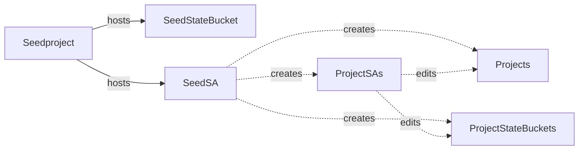
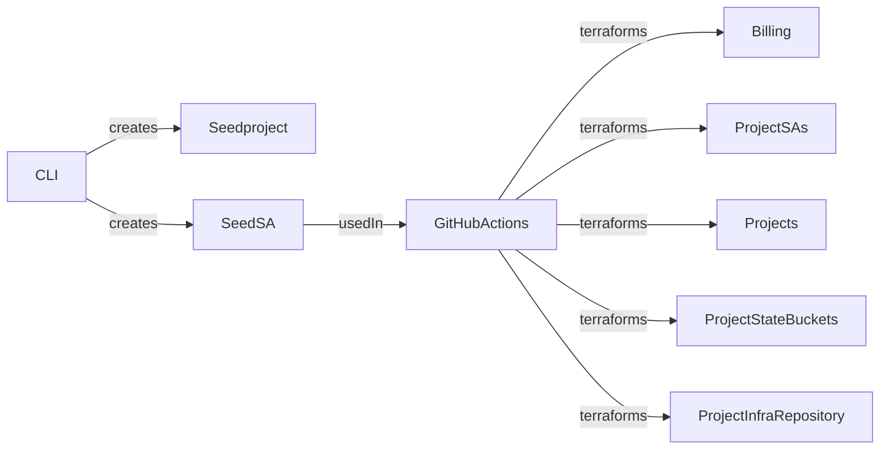

# Base infrastructure for Koenighotze on Google Cloud Platform

[](https://github.com/koenighotze/koenighotze-gcp-base-setup/actions/workflows/plan.yml)
[](https://github.com/koenighotze/koenighotze-gcp-base-setup/actions/workflows/apply.yml)
[](https://www.codacy.com/gh/koenighotze/koenighotze-gcp-base-setup/dashboard?utm_source=github.com&amp;utm_medium=referral&amp;utm_content=koenighotze/koenighotze-gcp-base-setup&amp;utm_campaign=Badge_Grade)


## How to use

There are four steps involved.

1. Setup the seed project and seed service account.
2. Setup child projects
3. Setup bootstrap infrastructure
4. Setup the detailed projects

Also, see the section on adding new projects.

Note: we are creating the projects using the CLI, because we are not running as part of a GCP organisation.

### Step 1: Setup the seed project and seed service account.

This step creates the seed project, required GCP APIs, billing account and Terraform state bucket. Basically everything we need to have, before we can use Terraform.

Execute `./scripts/create-seed-project.sh` to run this step.

Afterward create the seed service account which is used by this repository to appy Terraform configurations.

Execute [./scripts/create-seed-project.sh](./scripts/create-seed-project.sh) to run this step.

### Step 2: Setup child projects

This step creates the downstream projects and enables billing. The rest ist handled by Terraform.

Execute [./scripts/create-projects.sh](./scripts/create-projects.sh) to run this step.

### Step 3: Setup bootstrap infrastructure

This is handled by the GH Actions workflow [./github/workflows/bootstrap.yml](./.github/workflows/bootstrap.yml).

### Step 4: Setup the detailed projects

This is handled by the GH Actions workflow [./github/workflows/plan.yml](./.github/workflows/plan.yml) and [./github/workflows/apply.yml](./.github/workflows/apply.yml).

### Adding a new project

Adding a new project involves the following steps.

1. Create the GCP project
2. Add the project to the bootstrap configuration
3. Add the project's TF code

#### Step 1: Create the GCP project

Add the new project to [./scripts/projects.sh](./scripts/projects.sh) which contains the names of all projects handled by this setup.

And then execute 'Step 2: Setup child projects' from above.

#### Step 2: Add the project to the bootstrap configuration

Add the new project to [./bootstrap/locals-projects-configuration.tf](./bootstrap/locals-projects-configuration.tf) which details the projects. You can add the required GCP APIs and the roles needed for the SA responsible for the infrastructure.

#### Step 3: Add the project's TF code

Finally, add the project as a TF module. See [terraform-examples.tf](terraform-examples.tf) for details.

## Overview

Target structure is as follows:



The automation works as follows



## Setup instructions

Setup billing account and export its id to $BILLING_ACCOUNT. Generate a unique id and export it as $POSTFIX. E.g.,:

```bash
export BILLING_ACCOUNT=134
export POSTFIX=414xb1

./scripts/create-seed-project.sh $BILLING_ACCOUNT $POSTFIX
./scripts/create-seed-sa.sh $POSTFIX
./scripts/create-projects.sh $BILLING_ACCOUNT $POSTFIX
```

Set GH secrets on this repo manually:

- ADMIN_GITHUB_TOKEN
- GH_TOKEN_FOR_LABELING
- CODACY_API_TOKEN
- DOCKER_REGISTRY_TOKEN
- DOCKER_REGISTRY_USERNAME
