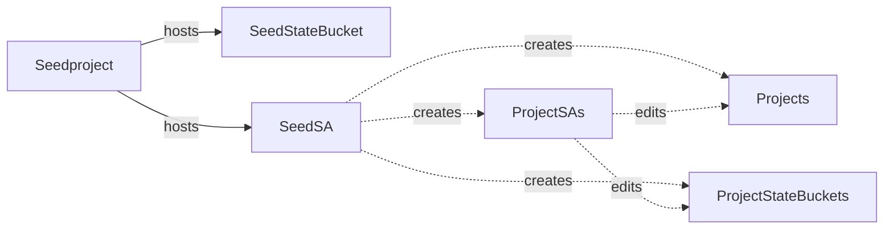
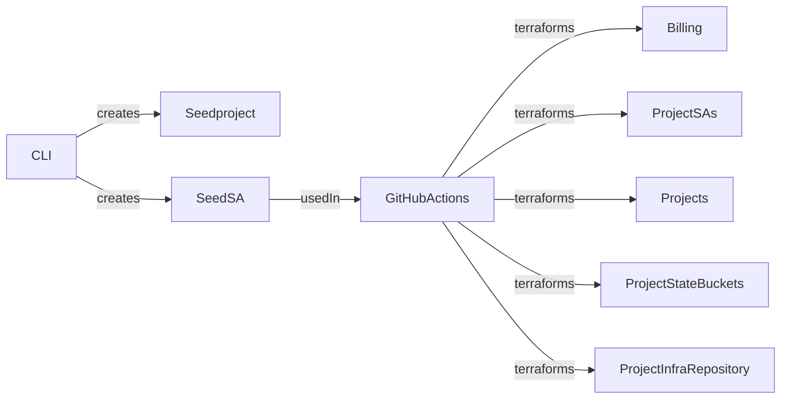

# Base infrastructure for Koenighotze on Google Cloud Platform

[](https://github.com/koenighotze/koenighotze-gcp-base-setup/actions/workflows/plan.yml)
[](https://github.com/koenighotze/koenighotze-gcp-base-setup/actions/workflows/apply.yml)


Target structure is as follows:



The automation works as follows



## Setup instructions

Setup billing account and export its id to $BILLING_ACCOUNT. Generate a unique id and export it as $POSTFIX. E.g.,:

```bash
export BILLING_ACCOUNT=134
export POSTFIX=414xb1

./scripts/create-seed-project.sh $BILLING_ACCOUNT $POSTFIX
./scripts/create-seed-sa.sh $POSTFIX
./scripts/create-projects.sh $BILLING_ACCOUNT $POSTFIX
```

Set GH secrets on this repo manually:

- ADMIN_GITHUB_TOKEN
- GH_TOKEN_FOR_LABELING
- CODACY_API_TOKEN
- DOCKER_REGISTRY_TOKEN
- DOCKER_REGISTRY_USERNAME
