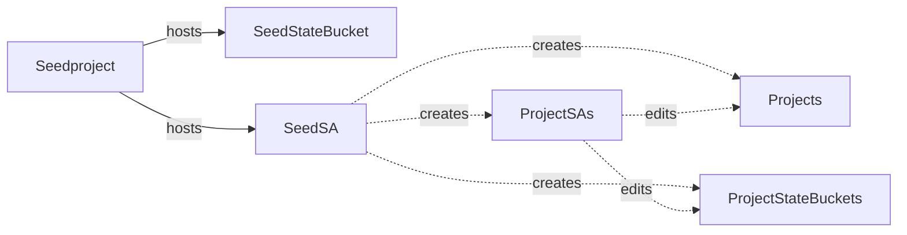
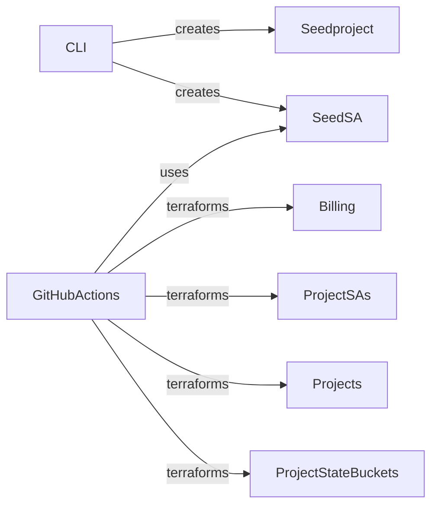

# Base infrastructure for Koenighotze on Google Cloud Platform

Target structure is as follows:

```mermaid
graph LR;
    Seedproject-- hosts -->SeedStateBucket;
    Seedproject-- hosts -->SeedSA;

    SeedSA-. creates .->ProjectSAs;
    SeedSA-. creates .->Projects;
    SeedSA-. creates .->ProjectStateBuckets;

    ProjectSAs-. edits .->Projects;
    ProjectSAs-. edits .->ProjectStateBuckets;
```

The automation works as follows

```mermaid
graph LR;
    CLI-- creates -->Seedproject & SeedSA;

    GitHubActions-- uses -->SeedSA;
    GitHubActions-- terraforms -->Billing;
    GitHubActions-- terraforms -->ProjectSAs & Projects & ProjectStateBuckets;
```
